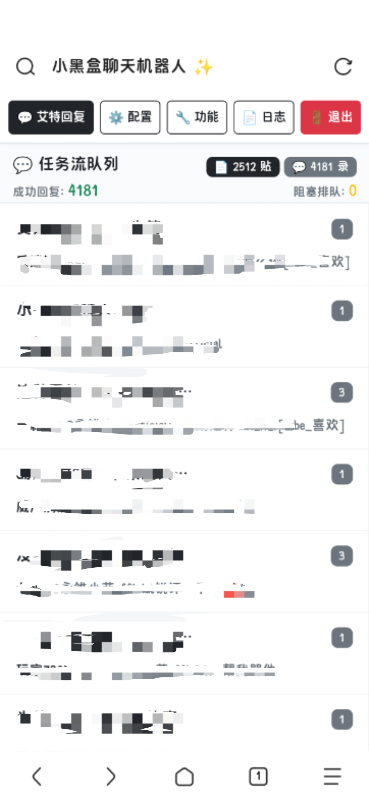
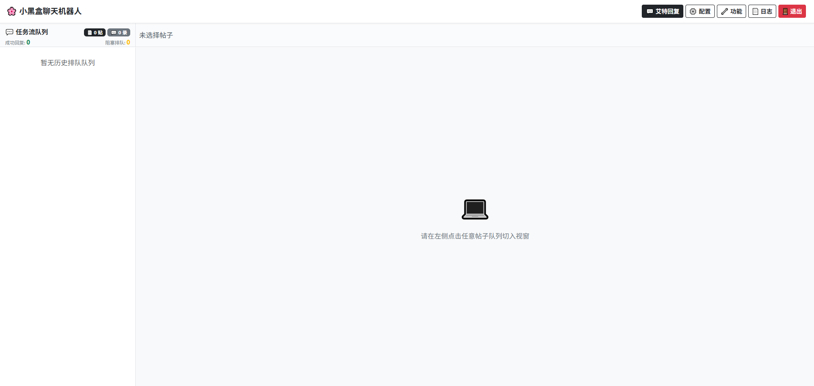
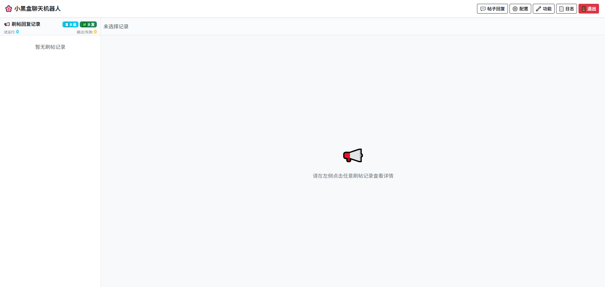
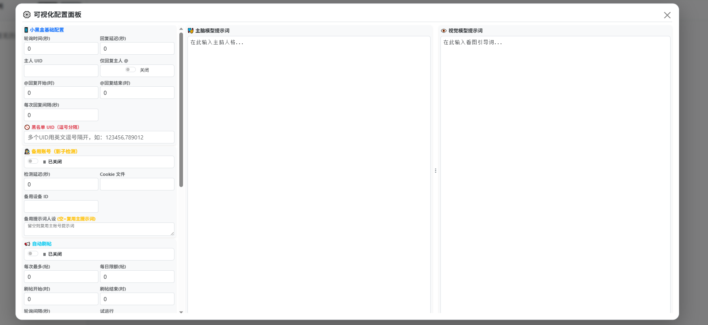
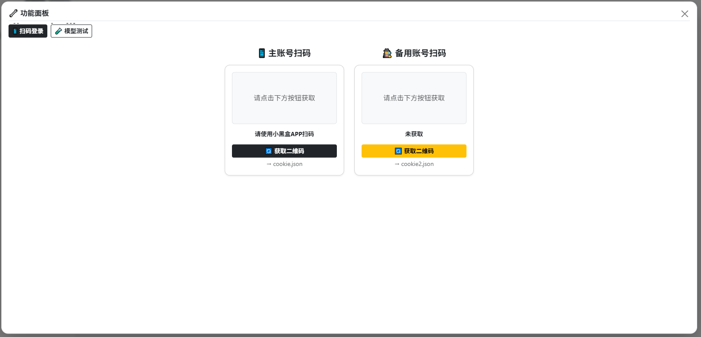
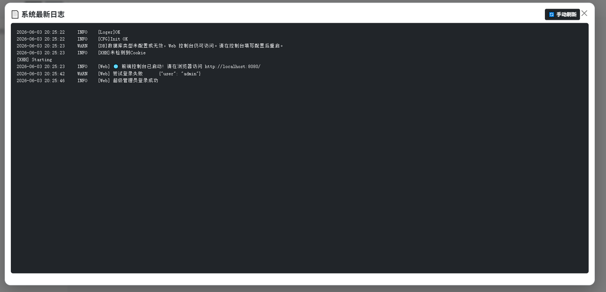

# xhhRobot

小黑盒（Xiaoheihe）社区 AI 自动回复机器人——监控 @-mention 并调用 OpenAI 兼容 API 生成评论，同时支持首页帖子自动评论。自带 Vue 3 Web 控制台，所有操作在浏览器中完成。



## 快速开始

全程在浏览器中操作，不需要手动编辑文件。

### 前置要求

- Go 1.21+
- OpenAI 兼容 API 的 Token（如 DeepSeek、Moonshot、智谱等）
- 小黑盒账号

### 使用流程

**1. 启动**

双击 `启动.bat`。程序自动启动 Web 控制台，后台循环进入静默等待（配置就绪前不会报错刷屏）。

**2. 打开控制台**

浏览器访问 `http://localhost:8080`，用管理员账号登录（`admin` / `admin123`）。

**3. 配置 → 扫码 → 自动运行**

| 步骤 | 面板 | 操作 |
|------|------|------|
| 填配置 | ⚙️ 配置 | 填入 AI Token、模型、提示词、主人 UID，点保存 |
| 扫码 | 🔧 功能 → 扫码登录 | 获取二维码 → 小黑盒 App 扫码 |
| 开工 | 自动 | 三个条件凑齐后 10 秒内自动开始工作 |

配置 ✓ + Cookie ✓ + 数据库 ✓ → 无需重启，自动运行。

## Web 控制台

单文件 Vue 3 SPA，Bootstrap 5 响应式布局，手机/桌面均可使用。

### 主界面 — 艾特回复

左侧任务流队列按帖子分组显示所有 @-消息，右侧为选中帖子的对话气泡。

点击顶部 **"任务流队列"** 标题栏可展开 **平台算力消耗统计**，按今日/本周/本月/自定义日期查看：

- 成功回复数
- 主脑 Token 消耗
- 视觉 Token 消耗



每条消息支持手动 **重发**（绕过 AI 直接用原内容重试），被吞评论会标注 🕵️ 备用号代发标记及替代内容。

### 帖子回复

切换到帖子回复模式查看自动刷帖记录，左侧为帖子列表（含状态标签：已发送/试运行/已跳过/失败），右侧展示帖子原文 + AI 回复。



### 配置面板

可视化编辑所有 `config.json` 字段，无需手动编辑文件：

| 区域 | 内容 |
|------|------|
| 小黑盒基础配置 | 轮询间隔、回复延迟、主人 UID、时间窗口、黑名单 |
| 备用账号 | 开关、Cookie 文件、备用设备 ID、备用 AI 人设 |
| 自动刷帖 | 开关、每次上限、每日限额、时间窗口、试运行模式 |
| AI 模型连接 | 主脑/视觉模型名称、API 地址、Token、深度思考/联网搜索开关 |
| 敏感词替换 | 动态添加/删除违禁词→安全词映射 |
| 提示词 | 左右分栏编辑主脑 + 视觉模型 System Prompt，可拖拽调整宽度 |

修改后点 **"保存并热重载配置"**，无需重启。数据库配置就绪时自动初始化。



### 功能面板

包含两个子面板：

**📱 扫码登录** — 主号和备用号分别扫码，二维码通过第三方 API 在线生成。扫码成功后 `cookie.json` 自动保存并热加载，无需重启。

**🧪 模型测试** — 手动输入文字+上传图片，指定模式（@回复/刷帖），实时调用 AI 并返回结果，显示主脑/视觉 Token 消耗和推理过程。



### 日志面板

实时查看控制台日志，方便排查问题（zap 结构化日志 + stdout 捕获）。



## 功能

### @-回复
- 轮询小黑盒消息列表，检测 @-mentions（type 16）
- 拉取帖子正文 + 图片 + 层主上下文，完整拼接 prompt
- AI 输出 `@召唤者`/`@层主`/`@帖主` 占位符，后处理为小黑盒 HTML `<a>` 蓝字标签
- 主人消息置顶优先回复，可配置仅回复主人

### 帖子回复
- 定时拉取首页 Feed 流，AI 判断帖子内容后自动评论
- 支持 dry-run 试运行（生成但不发送）
- 每日限额 + 每轮上限，时间窗口控制
- 详情获取失败时自动降级使用 Feed 摘要

### AI 能力
- **多模态视觉** — 自动提取帖子/评论图片，调用视觉模型生成描述注入上下文，LRU 缓存 100 条
- **双模型流水线** — 视觉模型和主脑模型可分别配置不同的 API 端点和 Token，或使用单一多模态模型
- **联网搜索** — DeepSeek 风格联网搜索，自动查梗、查黑话，支持搜索扩展
- **深度思考** — reasoning/thinking 模式，推理强度可配（none ~ xhigh），推理过程可查看

### 双账号容灾

```
主号发评论 → 成功 → 异步影子检测
                  ├── 未被吞 → 完成
                  └── 被吞 → 备用号补发（可选独立 AI 人格）

主号发评论 → 失败 → 检测 msg 关键词
                  ├── "账号异常/禁言/限制" → 主号进入冷却(默认6h)
                  │   ├── 备用号可用 → 接替发评论
                  │   └── 备用号不可用 → 丢弃
                  └── 其他错误 → 丢弃
```

### 防风控
- **违禁词替换** — 可配置敏感词→安全词映射表，自动替换
- **回复间隔控制** — 互斥锁 + 可配置间隔，防止并发爆回复
- **时间窗口** — 可配置回复时段（如 7:00~次日 3:00），窗口外暂停（主人可强行唤醒）
- **模拟打字延迟** — 根据回复字数计算随机延迟（3~16 秒）
- **验证码冷却** — 触发验证码后全局冷却 10 分钟，避免频繁请求，进程退出 code=2 配合 systemd 重启
- **账号限制检测** — 自动识别 API 返回的限制信息，触发主号冷却

## Bat 脚本说明

| 脚本 | 对应命令 | 用途 |
|------|----------|------|
| `启动.bat` | `go run main.go -mode start` | 生产模式启动。检测 Go 环境 → config.json → cookie.json，启动 Web 服务 + 三个后台循环 |
| `登录.bat` | `go run main.go -mode login` | 备选方案：终端扫码登录，二维码打印在命令行。适合 SSH/无桌面环境 |
| `一键打包.bat` | `go build -o xhhRobot.exe` | 编译 Windows 可执行文件，自动 go mod tidy + CGO_ENABLED=0 静态编译 |
| `打包Linux版.bat` | `GOOS=linux go build -o xhhRobot` | 交叉编译 Linux 可执行文件，Windows 上打包丢服务器 |

## 编译

| 目标 | 脚本 | 产物 |
|------|------|------|
| Windows | `一键打包.bat` | `xhhRobot.exe` |
| Linux | `打包Linux版.bat` | `xhhRobot` |

或手动：

```bash
# Windows
CGO_ENABLED=0 GOOS=windows GOARCH=amd64 go build -o xhhRobot.exe main.go

# Linux
CGO_ENABLED=0 GOOS=linux GOARCH=amd64 go build -o xhhRobot main.go
```

## 部署

编译后只需 **3 个文件**：

```
├── xhhRobot          # 可执行文件
├── config.json       # 配置文件（从 config.json.example 填写）
└── cookie.json       # Cookie（Web 控制台扫码获取）
```

> 备用账号还需 `cookie2.json`。

### systemd 守护（Linux 推荐）

```ini
# /etc/systemd/system/xhhrobot.service
[Unit]
Description=xhhRobot AI Reply Bot
After=network.target

[Service]
Type=simple
WorkingDirectory=/opt/xhhrobot
ExecStart=/opt/xhhrobot/xhhRobot -mode start
Restart=always
RestartSec=10

[Install]
WantedBy=multi-user.target
```

```bash
sudo systemctl daemon-reload
sudo systemctl enable --now xhhrobot
```

验证码冷却时进程 exit code=2，systemd 自动重启。

## 配置参考

### xhh（小黑盒 API）

| 字段 | 类型 | 默认值 | 说明 |
|------|------|--------|------|
| `checkTime` | int | 30 | @-消息轮询间隔（秒） |
| `replyTime` | int | 10 | 回复检查间隔（秒） |
| `owner` | string | — | 主人小黑盒 ID，逗号分隔多个，主人的消息置顶优先回复 |
| `reply_only_owner` | bool | false | 仅回复主人的 @ |
| `replyStartHour` | int | 7 | 回复窗口起始（时），0=不限制 |
| `replyEndHour` | int | 3 | 回复窗口结束（时），小于起始表示跨天 |
| `replyIntervalSeconds` | int | 15 | 两次回复最小间隔（互斥锁保护） |
| `banned_words` | object | — | 违禁词→替换词映射表 |
| `blacklist` | string | — | 黑名单 UID，逗号分隔 |
| `deviceID` | string | — | 设备指纹（留空自动生成） |
| `baseUrl` | string | api.xiaoheihe.cn | 小黑盒 API 地址 |

### ai（AI API）

| 字段 | 类型 | 默认值 | 说明 |
|------|------|--------|------|
| `model` | string | — | 主脑模型名称 |
| `prompt` | string | — | 系统提示词（角色设定） |
| `baseUrl` | string | — | API 地址（OpenAI 兼容格式） |
| `token` | string | — | API 密钥 |
| `vision_model` | string | — | 视觉模型名称 |
| `vision_prompt` | string | — | 视觉模型系统提示词 |
| `vision_base_url` | string | — | 视觉 API 地址（留空复用主脑） |
| `vision_token` | string | — | 视觉 API 密钥（留空复用主脑） |
| `enable_vision` | bool | false | 启用图片识别 |
| `vision_mode` | string | "dual" | dual=双模型独立 / single=单一多模态模型 |
| `enable_search` | bool | false | 启用联网搜索 |
| `enable_thinking` | bool | false | 启用深度思考 |
| `reasoning_effort` | string | "medium" | 推理强度（none/minimal/low/medium/high/xhigh） |
| `enable_search_extension` | bool | false | 搜索扩展 |
| `max_post_images` | int | 6 | 帖子图片上限 |
| `max_comment_images` | int | 3 | 评论图片上限 |

### feedReply（首页帖子回复）

| 字段 | 类型 | 默认值 | 说明 |
|------|------|--------|------|
| `enabled` | bool | false | 是否启用 |
| `startHour` | int | 8 | 运行窗口起始 |
| `endHour` | int | 23 | 运行窗口结束 |
| `interval` | int | 900 | 拉取间隔（秒） |
| `maxPerRun` | int | 1 | 每轮最多回复数 |
| `maxPerDay` | int | 10 | 每天最多回复数 |
| `dryRun` | bool | true | 试运行模式（生成但不发送） |

### fallback（备用账号容灾）

| 字段 | 类型 | 默认值 | 说明 |
|------|------|--------|------|
| `enabled` | bool | true | 启用备用账号 + 影子检测 |
| `checkDelaySeconds` | int | 12 | 影子检测延迟（秒） |
| `cookieFile` | string | "cookie2.json" | 备用 Cookie 文件路径 |
| `deviceID` | string | — | 备用设备指纹（留空复用主号） |
| `prompt` | string | — | 备用 AI 人格提示词（留空复用主 prompt） |
| `mainCooldownMinutes` | int | 360 | 主号被限制后的冷却时间（分钟） |

### database

| 字段 | 类型 | 默认值 | 说明 |
|------|------|--------|------|
| `type` | string | "sqlite" | 数据库类型（sqlite / pg） |
| `db` | string | — | SQLite 文件路径或 PG 数据库名 |
| `host` | string | — | PostgreSQL 主机 |
| `port` | string | — | PostgreSQL 端口 |
| `user` | string | — | PostgreSQL 用户名 |
| `passwd` | string | — | PostgreSQL 密码 |

## 架构

```
main.go
├── loger.InitLog()          # zap 日志 + Web 控制台 stdout 捕获
├── config.InitConfig()      # 读取 config.json，应用默认值
├── db.Init()                # SQLite / PostgreSQL 初始化 + 建表
│
├── xhh.Init()               # 加载 cookie.json，读取配置
├── xhh.Start()              # 启动 3 个并发循环
│   ├── CheckAt()            # 轮询 @-mentions → 写入 at 表
│   ├── AutoReply()          # 取待回复消息 → AI 生成 → 发评论
│   └── AutoFeedReply()      # 拉取首页帖子 → AI 生成 → 发评论
│
└── web.StartServer()        # HTTP :8080
    ├── GET  /               # index.html (Vue 3 SPA)
    ├── POST /api/login      # 登录获取 Bearer token
    ├── GET  /api/msgs       # 消息列表（分页/增量轮询/按ID批量）
    ├── GET  /api/stats      # @-回复统计数据
    ├── GET  /api/feed-stats # 帖子回复统计数据
    ├── GET  /api/feed-reply-records  # 帖子回复记录
    ├── GET  /api/config     # 读取 config.json（admin）
    ├── POST /api/config     # 写入 config.json + 热重载（admin）
    ├── GET  /api/qrcode     # 获取登录二维码（admin）
    ├── GET  /api/qrcheck    # 轮询扫码状态（admin）
    ├── GET  /api/qrcode2    # 备用账号扫码（admin）
    ├── GET  /api/qrcheck2   # 备用账号扫码状态（admin）
    ├── GET  /api/test-ai    # AI 模型手动测试（admin）
    ├── GET  /api/shadow-test # 影子评论手动测试（admin）
    ├── GET  /api/logs       # 控制台日志（admin）
    ├── GET  /api/retry      # 重置消息回复状态（admin）
    ├── GET  /api/feed-reply-test  # 手动触发刷帖（admin）
    └── GET  /api/restart    # 退出进程（admin，配合 systemd 重启）
```

### 一次 @-回复的完整链路

```
小黑盒消息 API → CheckAt() 轮询
  → db.Insert() 写入 at 表
  → AutoReply() db.GetComm(owner) 取待回复（主人优先 Top 3）
  → GetLinkInfo() 拉帖子正文 + 图片
  → GetRootComment() 拉层主上下文
  → ai.GetAiReply() 调用 AI API
    ├── 收集图片 → 视觉模型（LRU 缓存 100 条）
    ├── 拼接 prompt + 视觉报告 + 帖子正文 + 层主评论
    └── 返回 replyText + token 用量
  → 后处理：@-占位符 → HTML 标签 + 违禁词替换
  → 模拟打字延迟（字数/10 + 随机 0~4 秒）
  → Reply() 发评论（互斥锁保护）
    ├── 主号被限制？→ 备用号接替
    └── 成功？→ 异步影子检测 → 被吞？→ 备用号补发
  → db.Replyed() 更新状态 + token 用量
```

## 项目结构

```
xhhRobot/
├── main.go              # 入口，模式分发
├── go.mod / go.sum      # Go 模块依赖
├── index.html           # Web 控制台（Vue 3 + Bootstrap 5）
├── config.json.example  # 配置模板
├── README.md
├── docs/images/         # 文档截图
│
├── 启动.bat             # 生产模式启动
├── 登录.bat             # 终端扫码（备选）
├── 一键打包.bat          # 编译 Windows 版
├── 打包Linux版.bat       # 交叉编译 Linux 版
│
├── xhh/                 # 核心业务逻辑（11 files）
├── ai/                  # AI API 客户端
├── db/                  # 数据库层
├── web/                 # HTTP 服务 + API 端点
├── config/              # 配置管理
├── loger/               # 日志
├── sqlite/              # SQLite 初始化
└── pg/                  # PostgreSQL 初始化
```

## 安全提醒

部署到公网前务必修改 Web 控制台默认凭据。编辑 `web/server.go` 第 22-28 行常量后重新编译：

```go
const AdminUser = "admin"
const AdminPass = "admin123"   // ← 改掉
const AdminToken = "admin-token-change-me"  // ← 改掉
const GuestUser = "guest"
const GuestPass = "guest"      // ← 改掉
const GuestToken = "guest-token-change-me"  // ← 改掉
```

## 免责声明

本项目仅供个人学习和自用。自动化访问、自动回复、自动生图和频繁请求都可能触发平台风控。请自行控制频率，并遵守小黑盒相关规则。

## 致谢

感谢 [SomeOvO/xhhRobot](https://github.com/SomeOvO/xhhRobot) 原项目提供早期基础思路与实现参考。

## License

MIT
